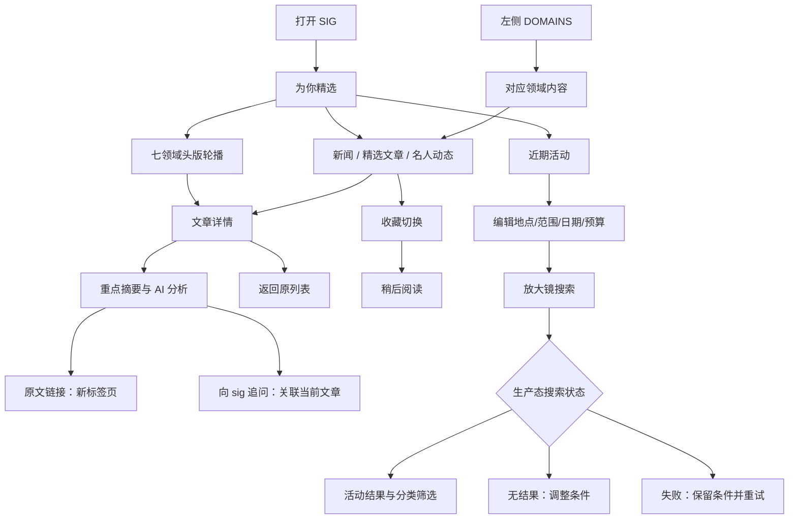
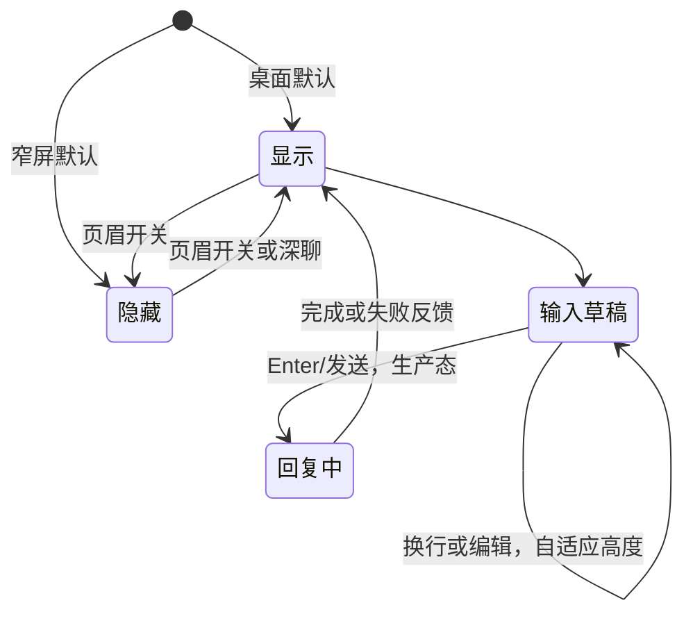

# UI Flow 与页面结构

## 概览

桌面使用三栏工作区：左导航、中内容、右助手。主要导航在一个 HTML 内切换，目前没有真实路由。下图为产品流程，生产态节点不表示已实现。

## 页面与入口

| 页面/区域 | 入口 | 关键内容 | 离开方式 |
| --- | --- | --- | --- |
| 为你精选 | 品牌、左栏 | 头版、类型标签、内容列表、活动入口 | 领域/详情/活动 |
| 领域列表 | DOMAINS | 领域标题、三类内容 | 其他领域、文章详情 |
| 详情 | 标题、阅读全文、深聊 | 摘要、AI 分析、追问提示、来源 | 返回列表 |
| 稍后阅读 | 左栏 | 已收藏列表，空态 | 原文或详情 |
| 近期活动 | 左栏/首页入口 | 紧凑搜索表单、分类、结果区域 | 导航 |
| sig | 页眉开关/深聊 | 上下文、消息、输入框 | 页眉开关隐藏 |

## 聊天与上下文

原型发送即时返回预设文本，没有「回复中」。正式版每条请求建议冻结发送时的 articleId/contextId，用户切换文章时不能让进行中的答案串到新文章。隐藏助手应保留草稿和消息。重置只作用于对话，不作用于阅读偏好。

## 早晚报与轮播

页眉切换版本 → 主题更新 → 当前列表按版本刷新 → 头版重建 → 当前上下文更新。每日鼓励句在同一洛杉矶日期保持一致。原型首次始终早报；生产默认选择哪一期待定。

轮播每 8 秒切换。悬停、键盘焦点进入、标签页隐藏时不推进；手动切换或触摸后暂停。减少动态效果偏好下默认暂停。进入详情时停止计时器。生产需处理零条、少于七条、缩放和侧栏显隐后的位置校准。

## 活动搜索

输入默认值 → 用户编辑 → 原生必填/数值/日期校验 → 搜索。原型只提示已记录条件，不产生真实结果。正式版应区分「正在编辑的条件」和「已提交查询」，分类筛选基于已提交查询，保留输入供修改。

当前日期控件精度是天，而原需求是「当前时刻起」；正式查询默认下界使用当前瞬间，人工日期筛选的日界线规则待确认。

## 总结

阅读是主路径，聊天伴随阅读；活动是独立的搜索路径。所有切换都应保持清楚的上下文与可返回入口。
